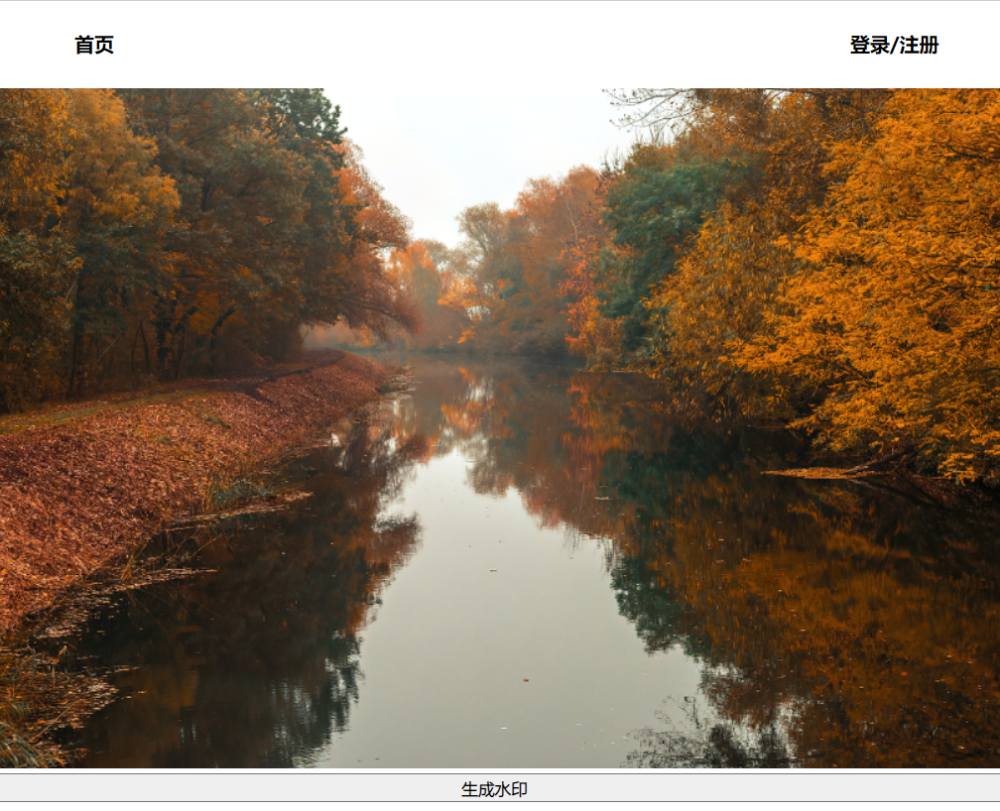
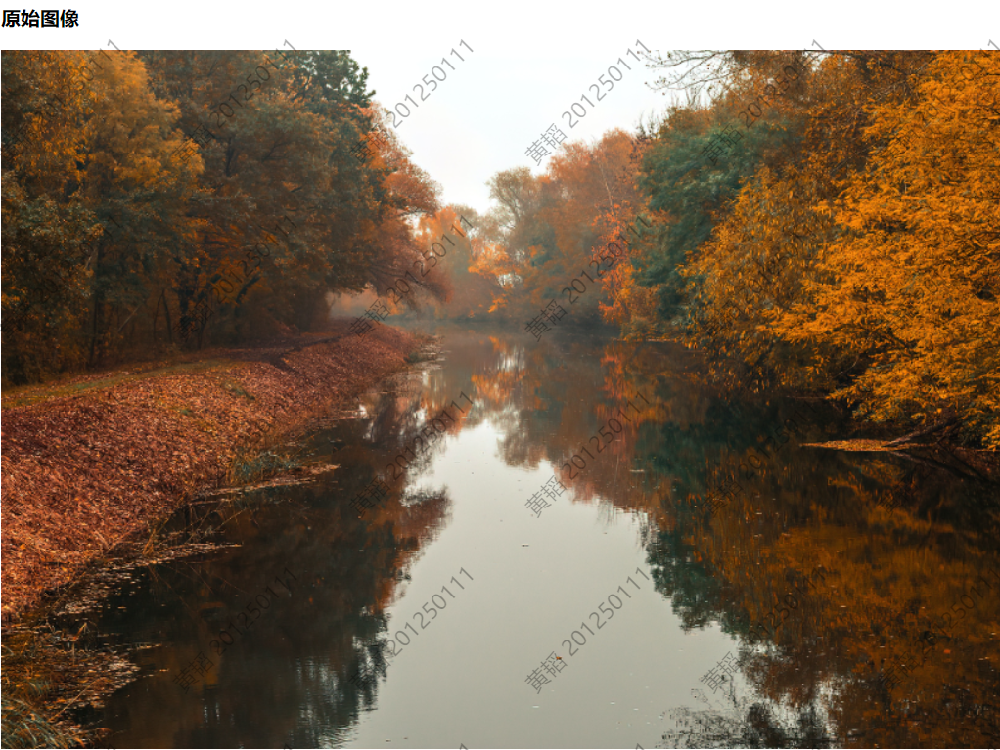
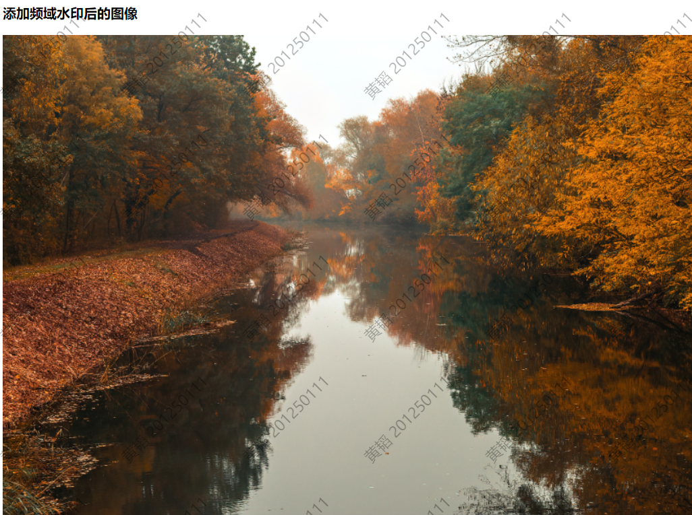
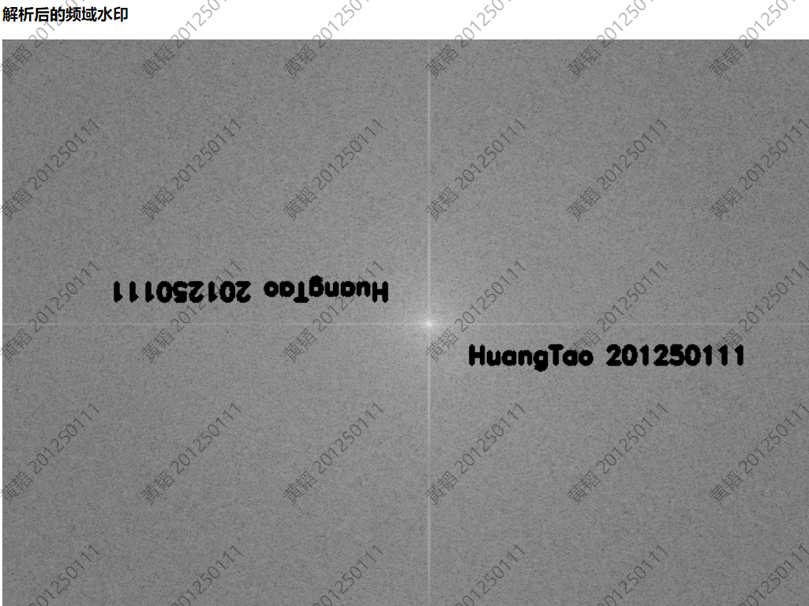

# Readme

### 动态水印

#### 结果水印图像

#### 实现

使用SVG方式，在watermark.css中设置相应属性，并将background-image的url转为base64编码。

### 频域水印

#### 原始图像

#### 使用方法的说明

在首页点击图片进入显示大图的二级页面后，图片下方有 **生成水印** 的按钮

按下可跳转到水印界面，含有可见动态水印以及频域水印的三张图片：**原始图像**、**添加频域水印后的图像**、**解析后的频域水印**。

#### 实现

使用opencv.js实现，通过split将原图片的多通道数组数据分裂成几个单通道数组，随后将数据传递给doDft函数，完成确定适合做傅里叶变换的图像最佳尺寸等前置处理后调用cv.dft方法对处理后的图像进行傅里叶变换操作并返回。之后调用cv.putText方法，将两个水印文字加入图像中，并使其中心对称。最后调用iDft函数，将图像进行傅里叶的逆变换，得到含有水印文字信息的图像。