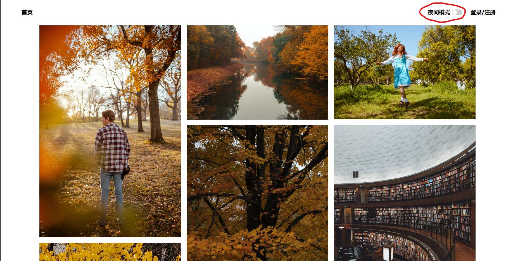
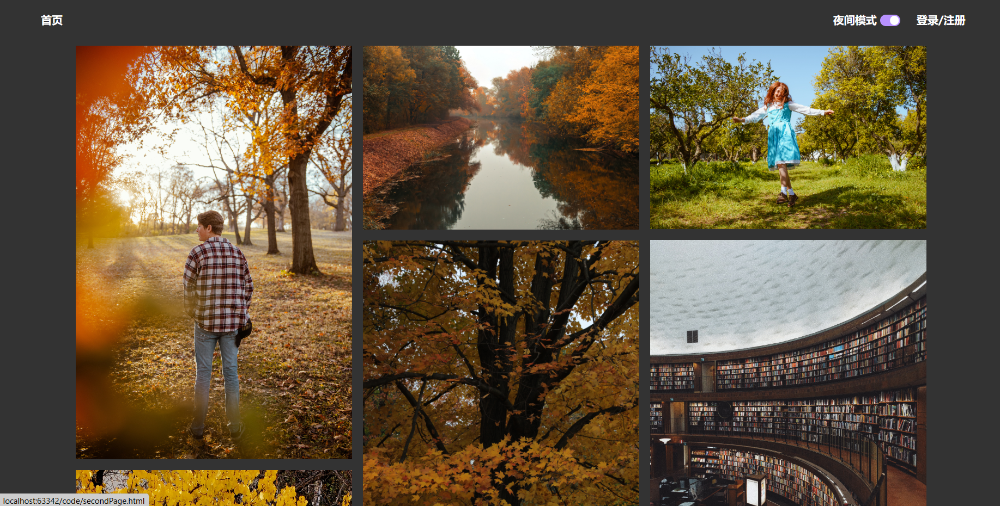
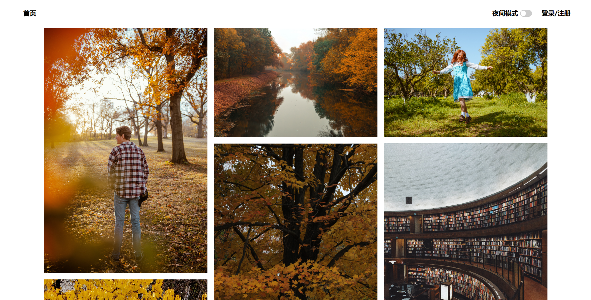

# Readme

### 方案

使用提前引入所有主题样式，做类名切换的方案。将黑暗主体的样式写入theme.css中，设置背景色与字体颜色。之后将changeMode方法绑定到顶部导航栏的一个checkbox上。changeMode方法内实现元素的类名切换，以达到点击checkbox实现主题切换的效果。

### 使用说明

顶部导航栏加入了**夜间模式**的开关：

点击**夜间模式**文字右侧开关，切换主体至夜间模式：

再次点击，切换至原始主题：

