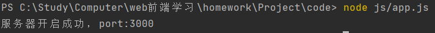
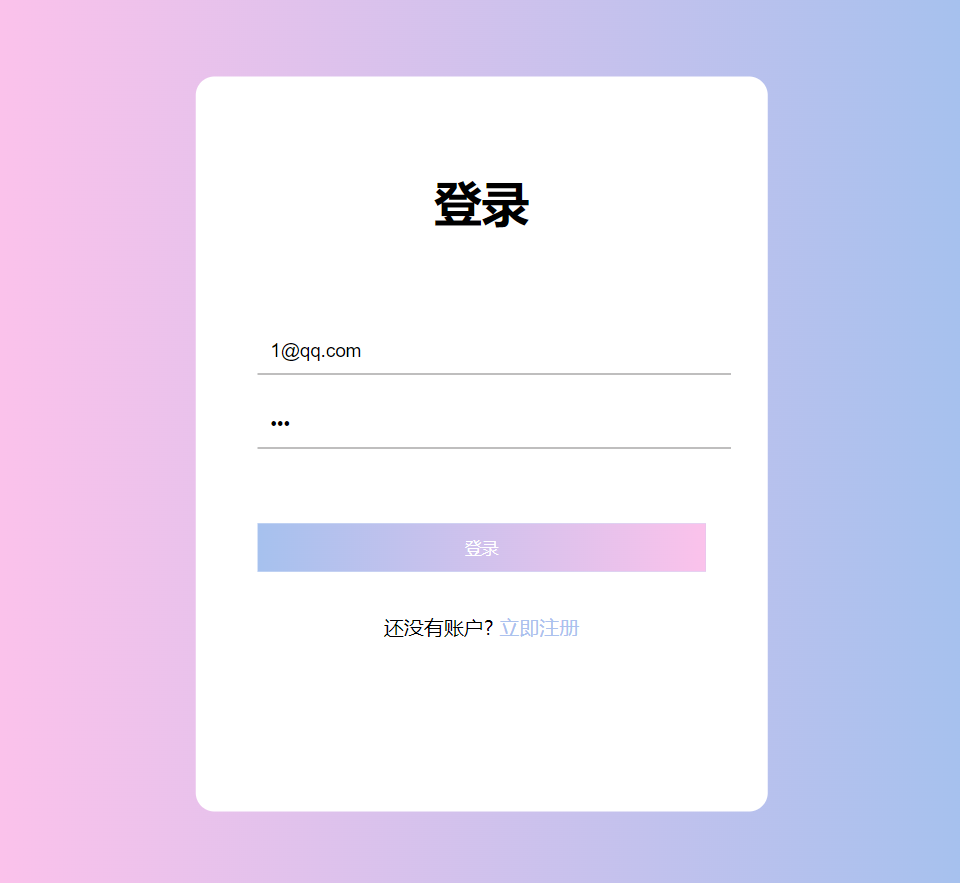
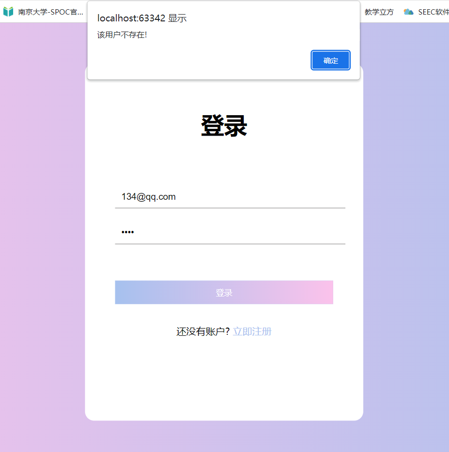
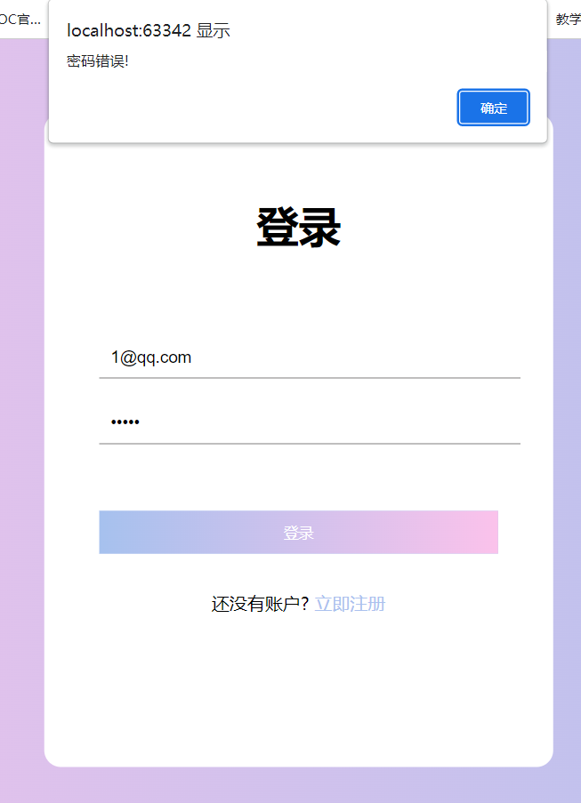
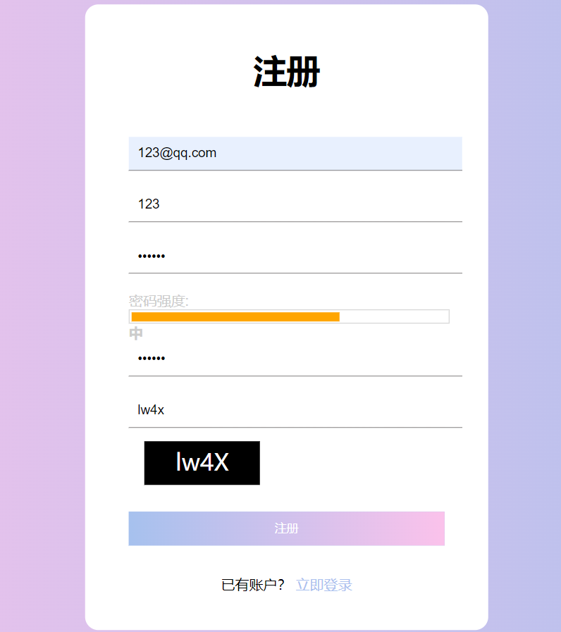
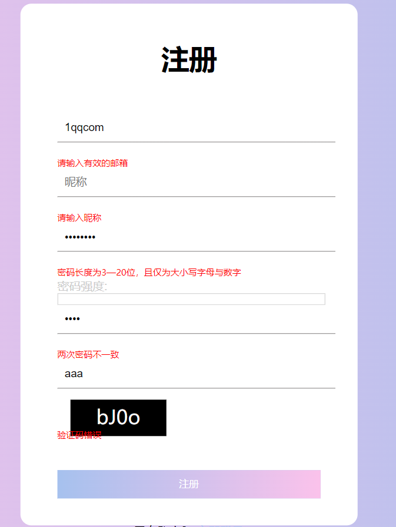
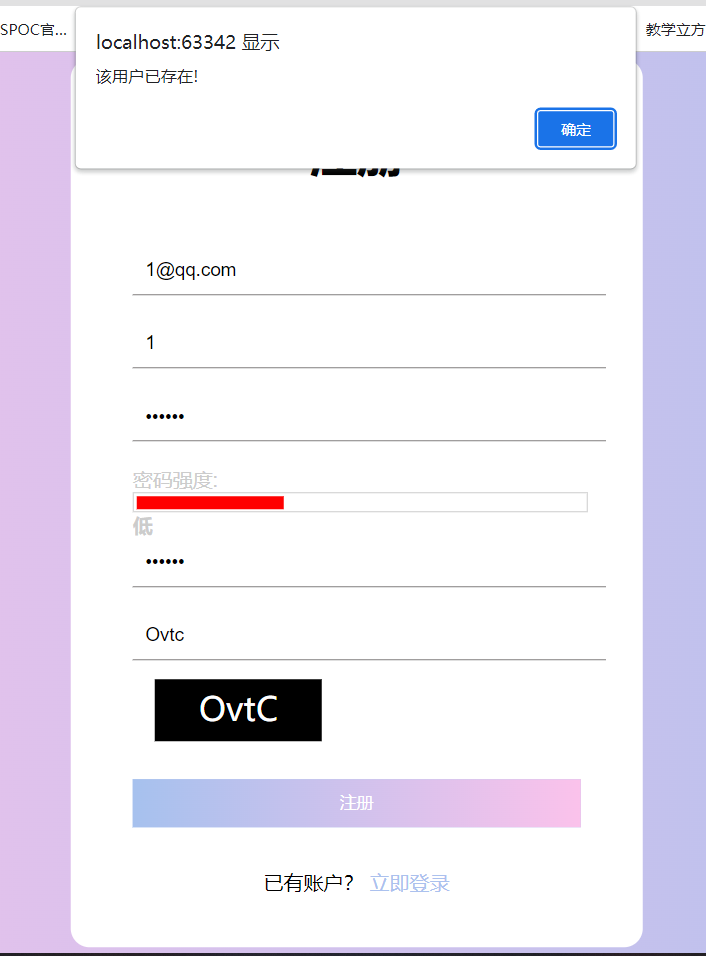

# ReadMe

### 实现方案

- 使用nodejs实现接受前台POST请求，完成登录注册功能。
- 数据库使用本地json文件方式保存。
- 对二级页面进行前端鉴权，若未登录则不能访问二级页面。
- 使用正则表达式对邮箱格式进行检查。
- 使用正则表达式对密码格式、密码强度进行检查。
- 使用MD5对密码进行加密。
- 用表驱动方式，利用随机数生成验证码图片。

### 安装

终端输入

```
npm install
```

### 运行过程

终端输入

```
cd js
node app.js
```

待服务器启动后打开**firstPage.html**即可正常使用。

### 可能的界面截图

- nodejs开启服务器

  

- 用户登录界面

  

- 登录错误

  - 用户不存在

  

  - 密码错误

  

- 用户注册界面

  

- 注册界面格式不符

  

- 注册错误

  

- 登录后的一级界面

  

- 登录后的二级界面

  

- 未登录时点击二级界面

  

### 参考文献

1. https://huaweicloud.csdn.net/639feb31dacf622b8df8ffec.html?spm=1001.2101.3001.6650.2&utm_medium=distribute.pc_relevant.none-task-blog-2%7Edefault%7EYuanLiJiHua%7Eactivity-2-127888229-blog-109439116.pc_relevant_multi_platform_whitelistv3&depth_1-utm_source=distribute.pc_relevant.none-task-blog-2%7Edefault%7EYuanLiJiHua%7Eactivity-2-127888229-blog-109439116.pc_relevant_multi_platform_whitelistv3&utm_relevant_index=5
2. https://github.com/zhangqiqi-engineer/node-app
3. https://blog.csdn.net/lzsan_/article/details/123905640
4. https://www.bilibili.com/video/av49391383/?vd_source=710faa737144795f20507fafafa0553e
5. https://blog.csdn.net/weixin_43750811/article/details/107236480?spm=1001.2101.3001.6650.1&utm_medium=distribute.pc_relevant.none-task-blog-2%7Edefault%7ECTRLIST%7ERate-1-107236480-blog-86329548.pc_relevant_multi_platform_whitelistv3&depth_1-utm_source=distribute.pc_relevant.none-task-blog-2%7Edefault%7ECTRLIST%7ERate-1-107236480-blog-86329548.pc_relevant_multi_platform_whitelistv3&utm_relevant_index=2