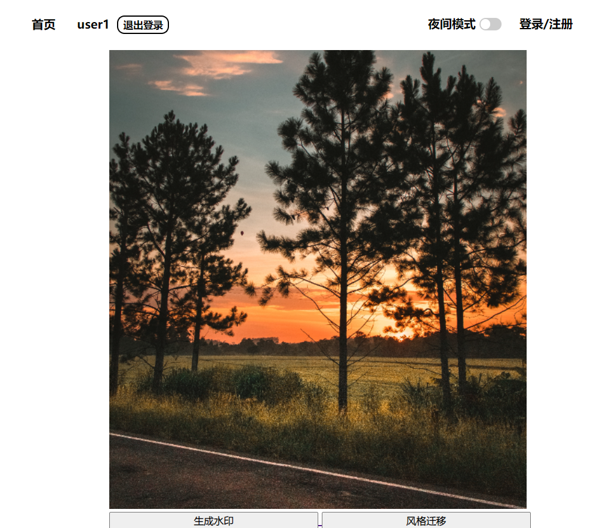
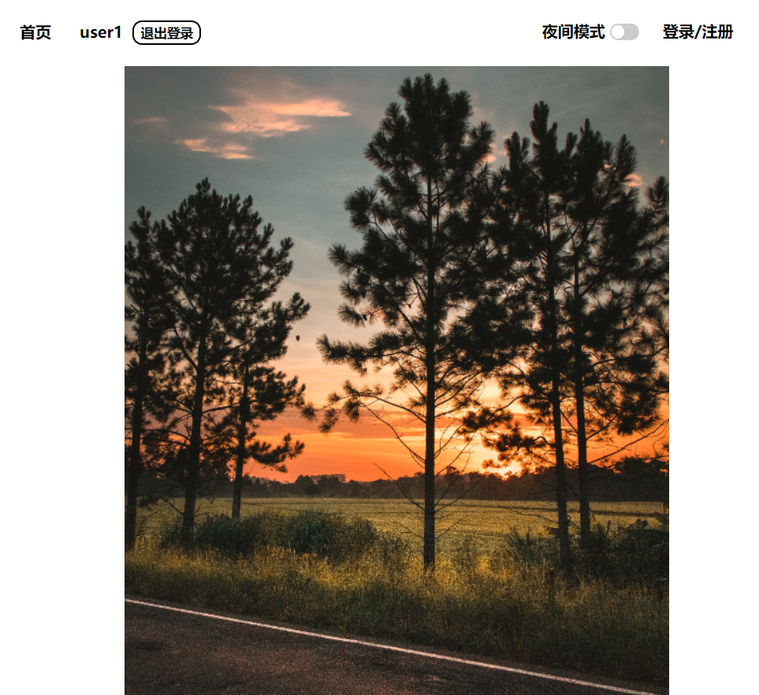
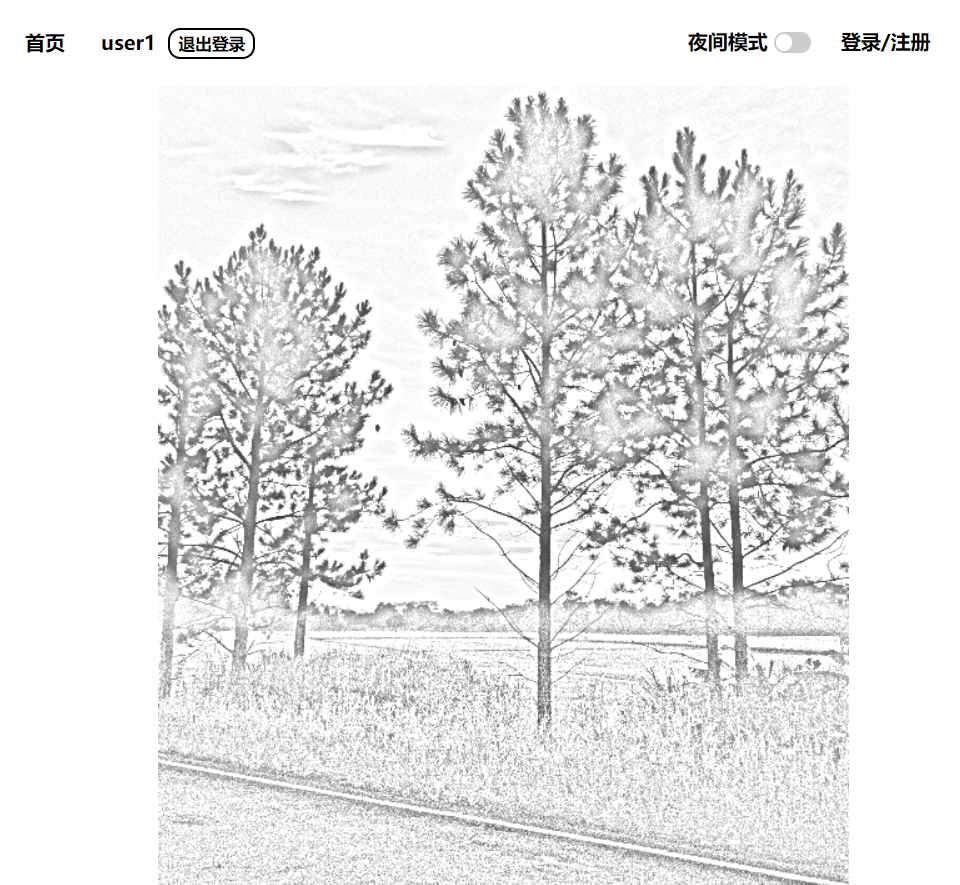
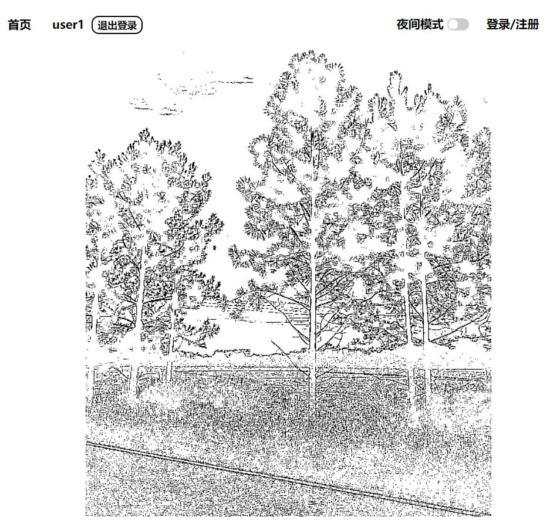

# ReadMe

### 实现方案

本次实验使用opencv实现了两种风格的迁移——铅笔素描风格与铅笔边缘风格。

- 铅笔素描风格
  1. 将原图片使用`cv.cvtColor`转换为灰度图
  2. 使用`cv.GaussianBlur`对灰度图进行高斯模糊处理
  3. 使用`cv.divide`利用灰度图、灰度模糊图生成图片的铅笔素描风格图
- 铅笔边缘风格
  1. 将原图片使用`cv.cvtColor`转换为灰度图
  2. 使用`cv.medianBlur`对灰度图应用中值模糊
  3. 使用`cv.Laplacian`，应用拉普拉斯滤波器来检测边缘
  4. 使用`cv.threshold`，根据指定的阈值将灰度图像转换为全黑或全白，其中 thresholding type属性设为cv.THRESH_BINARY_INV，对Laplacian滤波器的结果求反

### 安装

终端输入

```
npm install
```

### 运行过程

终端输入

```
cd js
node app.js
```

待服务器启动后打开**firstPage.html**，点击**登录/注册**，输入测试用账户：

```
邮箱: 1@qq.com
密码: 123
```

登陆成功后点击任一图片，进入大图后点击下方**“风格迁移”**按钮，即可进入风格迁移页面，看到不同风格的图片。

### 界面截图

- 进入大图页面后下方有**“风格迁移”**按钮

  

- 点击**“风格迁移”**按钮后，跳转到风格迁移页面。该页面显示三张图片：原始图像、铅笔素描风格、铅笔边缘风格

  - 原始图像

    

  - 铅笔素描风格

    

  - 铅笔边缘风格

    

### 参考文献

1. https://docs.opencv.org/4.2.0/d5/d10/tutorial_js_root.html
2. https://cloud.tencent.com/developer/article/1678909
3. https://www.jb51.net/article/257984.htm